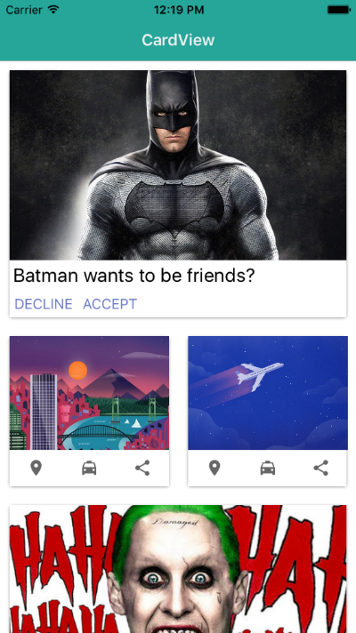

[](http://nstudio.io)
[](https://www.npmjs.com/package/nativescript-cardview)
[](https://www.npmjs.com/package/nativescript-cardview)

# NativeScript CardView :diamonds: :clubs:

A NativeScript plugin to provide an XML widget to implement the Material Design CardView component.

##### [Material Design Card Spec](https://www.google.com/design/spec/components/cards.html)
##### [CardView Android Documentation](http://developer.android.com/intl/zh-tw/reference/android/support/v7/widget/CardView.html)


## Installation

##### NativeScript 2.x
- `tns plugin add nativescript-cardview@^1.3.2`

##### NativeScript 3+
- `tns plugin add nativescript-cardview`

*Be sure to run a new build after adding plugins to avoid any issues. Here is a post with some details: https://bradmartin.net/2016/07/20/ahhh-this-nativescript-plugin-doesnt-work/*
  
## Vanilla NativeScript

 <span style="color:red">IMPORTANT: </span>*Make sure you include `xmlns:Card="nativescript-cardview"` on the Page element*

### XML
```XML
<Page xmlns:Card="nativescript-cardview">
   <StackLayout>     
      <Card:CardView class="cardStyle" margin="10" elevation="40" radius="5">
           <grid-layout rows="200, auto, auto" columns="auto, auto, *">
               <image src="~/images/batman.jpg" stretch="aspectFill" colSpan="3" row="0" />
               <label text="Batman wants to be friends?" class="info" textWrap="true" row="1" colSpan="3" />          
               <button text="DECLINE" tap="goAway" row="2" col="0" />
               <button text="ACCEPT" row="2" col="1" />
           </grid-layout>
       </Card:CardView>
   </StackLayout>
</Page>
```

### CSS
```CSS
.cardStyle {
    background-color: #3489db;
    color: #fff;
}
```


## Angular NativeScript

```TS
import * as elementRegistryModule from 'nativescript-angular/element-registry';
elementRegistryModule.registerElement("CardView", () => require("nativescript-cardview").CardView);
```

```XML
<CardView class="cardStyle" margin="10" elevation="40" radius="1" >
	<GridLayout rows="10,30,30,250, auto, auto,10" columns="10,40, *, 30,10">
		<Image src="res://profile" stretch="aspectFit" verticalAlignment="stretch" col="1" row="1" rowSpan="2"></Image>
		<Label class="createdBy text-left" horizontalAlignment="left" [text]="item.CreatedBy" row="1" col="2" textWrap="true"></Label>
		<Label class="createdOn text-left" horizontalAlignment="left" [text]="item.UpdatedDate" row="2" col="2"></Label>
		<Image [src]="'https://img.youtube.com/vi/'+item.MediaURL+'/mqdefault.jpg'" stretch="aspectFit" colSpan="3" col="1" row="3"></Image>
		<Label horizontalAlignment="left" [text]="item.Title" colSpan="3" row="4" textWrap="true" col="1"></Label>
		<Label  horizontalAlignment="left" [text]="item.Summary" textWrap="true" col="1" row="5" colSpan="3"></Label>
	</GridLayout>
</CardView>
```

## Attributes

* **radius** *optional*

An attribute to control the 'border-radius' of the card.

### Platform specific options

#### Android

* **elevation** *optional*

 An attribute to set the elevation of the card. This will increase the 'drop-shadow' of the card.
There can be some performance impact when using a very high elevation value.

#### iOS

* **shadowOffsetWidth** *optional*

An attribute to offset the x position of the shadow behind the card.
 
* **shadowOffsetHeight** *optional*

An attribute to offset the y position of the shadow behind the card.

* **shadowColor** *optional*

An attribute to set the color of the shadow behind the card.

* **shadowOpacity** *optional*

An attribute to set the opacity of the shadow behind the card.

* **shadowRadius** *optional*

An attribute to set the radius of the shadow (shadow spread) behind the card.

The default values are set to:
``` 
radius = 2;
shadowOffsetWidth = 0;
shadowOffsetHeight = 2;
shadowColor = new Color('#000').ios
shadowOpacity = 0.4;
shadowRadius = 1;
```

## Sample Screenshots

#### Android

Sample 1 |  Sample 2
-------- | ---------
 | 


#### iOS

Sample 1 |  Sample 2
-------- | ---------
 | 


#### Contributing
[Please follow here](https://github.com/bradmartin/nativescript-cardview/blob/master/CONTRIBUTING.md)

#### Contributors

[](https://github.com/bradmartin) |[](https://github.com/NathanWalker) |[](https://github.com/manijak) |[](https://github.com/NathanaelA) |[](https://github.com/EddyVerbruggen) |[](https://github.com/sis0k0) |
:---: |:---: |:---: |:---: |:---: |:---: |
[bradmartin](https://github.com/bradmartin) |[NathanWalker](https://github.com/NathanWalker) |[manijak](https://github.com/manijak) |[NathanaelA](https://github.com/NathanaelA) |[EddyVerbruggen](https://github.com/EddyVerbruggen) |[sis0k0](https://github.com/sis0k0) |

[](https://github.com/vladimirnani) |[](https://github.com/DickSmith) |
:---: |:---: |
[vladimirnani](https://github.com/vladimirnani) |[DickSmith](https://github.com/DickSmith) |


## [nStudio, LLC](http://nstudio.io)
[](http://nStudio.io)

Do you need assistance on your project or plugin? Contact the nStudio team anytime at <team@nstudio.io> to get up to speed with the best practices in mobile and web app development.