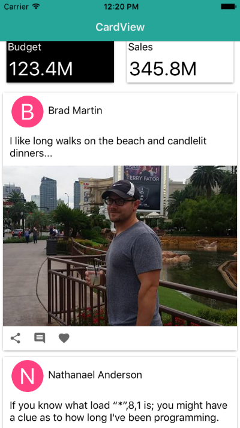

[](https://www.npmjs.com/package/nativescript-cardview)
[](https://www.npmjs.com/package/nativescript-cardview)

# NativeScript CardView :diamonds: :clubs:

A NativeScript plugin to provide an XML widget to implement the Material Design CardView component.

##### [Material Design Card Spec](https://www.google.com/design/spec/components/cards.html)
##### [CardView Android Documentation](http://developer.android.com/intl/zh-tw/reference/android/support/v7/widget/CardView.html) 
##### iOS version uses the [MaterialCard](https://cocoapods.org/pods/MaterialCard) pod by [Nathan Walker](https://github.com/NathanWalker)


## Installation
`npm install nativescript-cardview`
  
## Usage

 <span style="color:red">IMPORTANT: </span>*Make sure you include `xmlns:Card="nativescript-cardview"` on the Page element*

### XML
```XML
<Page xmlns:Card="nativescript-cardview">
   <StackLayout>     
      <Card:CardView class="cardStyle" margin="10" elevation="40" radius="5">
           <grid-layout rows="200, auto, auto" columns="auto, auto, *">
               <image src="~/images/batman.jpg" stretch="aspectFill" colSpan="3" row="0" />
               <label text="Batman wants to be friends?" class="info" textWrap="true" row="1" colSpan="3" />          
               <button text="DECLINE" tap="goAway" row="2" col="0" />
               <button text="ACCEPT" row="2" col="1" />
           </grid-layout>
       </Card:CardView>
   </StackLayout>
</Page>
```

### CSS
```CSS
.cardStyle {
    background-color: #3489db;
    color: #fff;
}
```

## Attributes

* **radius** *optional*

An attribute to control the 'border-radius' of the card.

### Platform specific options

#### Android

* **elevation** *optional*

 An attribute to set the elevation of the card. This will increase the 'drop-shadow' of the card.
There can be some performance impact when using a very high elevation value.

#### iOS

* **shadowOffsetWidth** *optional*

An attribute to offset the x position of the shadow behind the card.
 
* **shadowOffsetHeight** *optional*

An attribute to offset the y position of the shadow behind the card.

* **shadowColor** *optional*

An attribute to set the color of the shadow behind the card.

* **shadowOpacity** *optional*

An attribute to set the opacity of the shadow behind the card.

The default values are set to:
``` 
radius = 2;
shadowOffsetWidth = 0;
shadowOffsetHeight = 2;
shadowColor = new Color('#000').ios
shadowOpacity = 0.4;
```

## Sample Screenshots

#### Android

Sample 1 |  Sample 2
-------- | ---------
 | 

Sample 3 | Sample 4
-------- | -------
 | 

#### iOS

Sample 1 |  Sample 2
-------- | ---------
 | 

Sample 3 | Sample 4
-------- | -------
 | 

#### Contributing
[Please follow here](https://github.com/bradmartin/nativescript-cardview/blob/master/CONTRIBUTING.md)

#### Contributors
- [NathanaelA](https://github.com/NathanaelA)
- [NathanWalker](https://github.com/NathanWalker)
